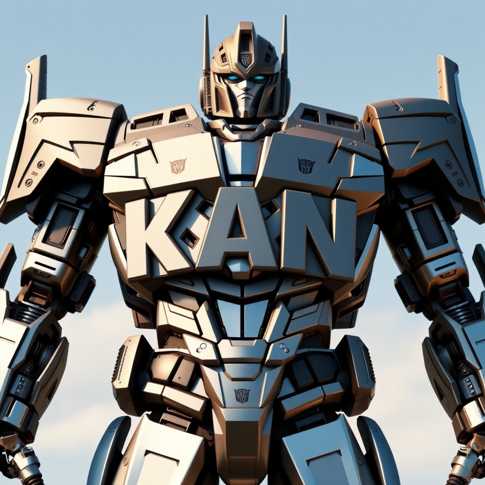

<div align="center">
  <table>
    <tr>
      <td></td>
      <td><h1>Kolmogorov–Arnold Transformer: <br>A PyTorch Implementation</h1></td>
    </tr>
  </table>
</div>

<p align="center">
<a href="https://arxiv.org/abs/2405.07992" alt="arXiv">
    </a>
      <a href="https://pytorch.org/"></a>
  <a href="https://opensource.org/licenses/MIT"></a>
</p>

<p align="center">
 <br>
</p>

🎉 This is a PyTorch/GPU implementation of the paper **Kolmogorov–Arnold Transformer (KAT)**, which replace the MLP layers in vision transformer with KAN layers.

**Kolmogorov–Arnold Transformer**

 📝[[Paper](https://arxiv.org/abs/2407.06182)] </>[[code](https://github.com/Adamdad/kat)]

Xingyi Yang, Xinchao Wang

National University of Singapore

### 🔑 Key Insight:

The KAT model integrates KANs into transformers for large-scale training scenarios such as ImageNet, showing significant performance improvements.

Three solutions we introduce:
1. **Base Function**: Change from B-spline to CUDA-implemented Rational.
2. **Group KAN**: Share weights among groups of edges.
3. **Initialization**: Maintain activation magnitudes across layers.

### Updates
- [x] Release the paper, CUDA implementation and IN-1k training code.
- [ ] Detection and segmentation code.
- [ ] KAN on NLP tasks.

## 🛠️ Installation and Dataset

```shell
# install torch and other things
pip install timm==1.0.3
pip install wandb # I personally use wandb for results visualizations
git clone https://github.com/Adamdad/rational_kat_cu.git
cd rational_kat_cu
pip install -e .
```
please refer to `https://github.com/Adamdad/rational_kat_cu.git` for the cuda rational function installation

📦 Data preparation: ImageNet with the following folder structure, you can extract ImageNet by this [script](https://gist.github.com/BIGBALLON/8a71d225eff18d88e469e6ea9b39cef4)

```
│imagenet/
├──train/
│  ├── n01440764
│  │   ├── n01440764_10026.JPEG
│  │   ├── n01440764_10027.JPEG
│  │   ├── ......
│  ├── ......
├──val/
│  ├── n01440764
│  │   ├── ILSVRC2012_val_00000293.JPEG
│  │   ├── ILSVRC2012_val_00002138.JPEG
│  │   ├── ......
│  ├── ......
```

## Usage

Refer to `example.py` for a detailed use case demonstrating how to use KAT with timm to classify an image.

## 📊 Model Checkpoints
Download pre-trained models or access training checkpoints:

|🏷️ Model |⚙️ Setup |📦 Param| 📈 Top1 |🔗 Link|
| ---|---|---| ---|---|
|KAT-T| From Scratch|5.7M | 74.6| [link](https://github.com/Adamdad/kat/releases/download/checkpoint/kat_small_patch16_224_32487885cf13d2c14e461c9016fac8ad43f7c769171f132530941e930aeb5fe2.pth)/[huggingface](https://huggingface.co/adamdad/kat_tiny_patch16_224)
|KAT-T | From ViT | 5.7M | 75.7| [link](https://github.com/Adamdad/kat/releases/download/checkpoint/kat_tiny_patch16_224-finetune_64f124d003803e4a7e1aba1ba23500ace359b544e8a5f0110993f25052e402fb.pth)/[huggingface](https://huggingface.co/adamdad/kat_tiny_patch16_224.vitft)
|KAT-S| From Scratch| 22.1M | 81.2| [link](https://github.com/Adamdad/kat/releases/download/checkpoint/kat_tiny_patch16_224_1f3ad3b2e69821f3d412f2924cf159a0e266f142d739cb68f68f796f5a0fe289.pth)/[huggingface](https://huggingface.co/adamdad/kat_small_patch16_224)
|KAT-S | From ViT |22.1M | 82.0| [link](https://github.com/Adamdad/kat/releases/download/checkpoint/kat_small_patch_224-finetune_3ae087a4c28e2993468eb377d5151350c52c80b2a70cc48ceec63d1328ba58e0.pth)/[huggingface](https://huggingface.co/adamdad/kat_small_patch16_224.vitft)
| KAT-B| From Scratch |86.6M| 82.3 | [link](https://github.com/Adamdad/kat/releases/download/checkpoint/kat_base_patch16_224_abff874d925d756d15cde97303f772a3460ddbd44b9c53fb9ce5cf15be230fb6.pth)/[huggingface](https://huggingface.co/adamdad/kat_base_patch16_224)
|  KAT-B | From ViT |86.6M| 82.8 | [link](https://huggingface.co/adamdad/kat_pretained/resolve/main/kat_base_patch16_224-finetune_440bf1ead9dd8ecab642078cfb60ae542f1fa33ca65517260501e02c011e38f2.pth)/[huggingface](https://huggingface.co/adamdad/kat_base_patch16_224.vitft)|

## 🎓Model Training

All training scripts are under `scripts/`
```shell
bash scripts/train_kat_tiny_8x128.sh
```

If you want to change the hyper-parameters, can edit
```shell
#!/bin/bash
DATA_PATH=/local_home/dataset/imagenet/

bash ./dist_train.sh 8 $DATA_PATH \
    --model kat_tiny_swish_patch16_224 \ # Rationals are initialized to be swish functions 
    -b 128 \
    --opt adamw \
    --lr 1e-3 \
    --weight-decay 0.05 \
    --epochs 300 \
    --mixup 0.8 \
    --cutmix 1.0 \
    --sched cosine \
    --smoothing 0.1 \
    --drop-path 0.1 \
    --aa rand-m9-mstd0.5 \
    --remode pixel --reprob 0.25 \
    --amp \
    --crop-pct 0.875 \
    --mean 0.485 0.456 0.406 \
    --std 0.229 0.224 0.225 \
    --model-ema \
    --model-ema-decay 0.9999 \
    --output output/kat_tiny_swish_patch16_224 \
    --log-wandb
```

## 🧪 Evaluation
To evaluate our `kat_tiny_patch16_224` models, run:

```shell
DATA_PATH=/local_home/dataset/imagenet/
CHECKPOINT_PATH=kat_tiny_patch16_224_1f3ad3b2e69821f3d412f2924cf159a0e266f142d739cb68f68f796f5a0fe289.pth
python validate.py $DATA_PATH --model kat_tiny_patch16_224 \
    --checkpoint $CHECKPOINT_PATH -b 512

###################
Validating in float32. AMP not enabled.
Loaded state_dict from checkpoint 'kat_tiny_patch16_224_1f3ad3b2e69821f3d412f2924cf159a0e266f142d739cb68f68f796f5a0fe289.pth'
Model kat_tiny_patch16_224 created, param count: 5718328
Data processing configuration for current model + dataset:
        input_size: (3, 224, 224)
        interpolation: bicubic
        mean: (0.485, 0.456, 0.406)
        std: (0.229, 0.224, 0.225)
        crop_pct: 0.875
        crop_mode: center
Test: [   0/98]  Time: 3.453s (3.453s,  148.28/s)  Loss:  0.6989 (0.6989)  Acc@1:  84.375 ( 84.375)  Acc@5:  96.875 ( 96.875)
.......
Test: [  90/98]  Time: 0.212s (0.592s,  864.23/s)  Loss:  1.1640 (1.1143)  Acc@1:  71.875 ( 74.270)  Acc@5:  93.750 ( 92.220)
 * Acc@1 74.558 (25.442) Acc@5 92.390 (7.610)
--result
{
    "model": "kat_tiny_patch16_224",
    "top1": 74.558,
    "top1_err": 25.442,
    "top5": 92.39,
    "top5_err": 7.61,
    "param_count": 5.72,
    "img_size": 224,
    "crop_pct": 0.875,
    "interpolation": "bicubic"
}
```


## 🙏 Acknowledgments
We extend our gratitude to the authors of [rational_activations](https://github.com/ml-research/rational_activations) for their contributions to CUDA rational function implementations that inspired parts of this work.

## 📚 Bibtex
If you use this repository, please cite:
```bibtex
@misc{yang2024compositional,
    title={Kolmogorov–Arnold Transformer},
    author={Xingyi Yang and Xinchao Wang},
    year={2024},
    eprint={XXXX},
    archivePrefix={arXiv},
    primaryClass={cs.CV}
}
```